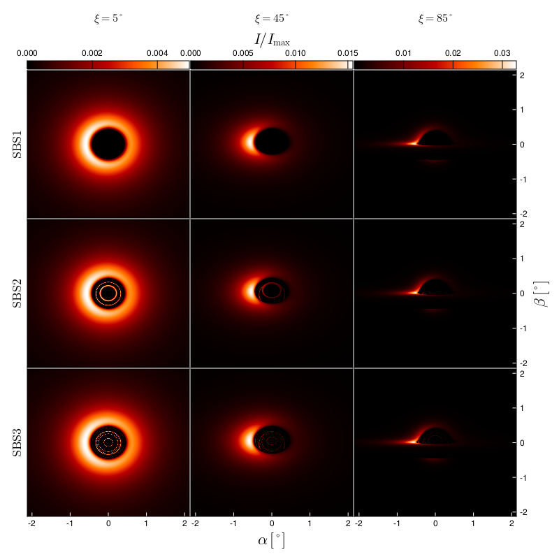

# BosonStars

  

This repository contains the code for the production runs and plots in "[Accretion disks and relativistic line broadening in boson star spacetimes](https://arxiv.org/abs/2403.11540)" by J. L. Rosa, J. Pelle, and D. Perez. It uses the open-source Julia package [Skylight.jl](https://github.com/joaquinpelle/Skylight.jl) for general-relativistic ray tracing and radiative transfer in arbitrary spacetimes.   

If you find this codebase useful for your work, we kindly request to cite our preprint.

### Requirements

The code requires Julia (version at least 1.6), and the following Julia packages to be installed:

- CairoMakie
- Colors
- DelimitedFiles
- Parameters
- Printf
- Skylight 

### Installation

We recommend that you create a dedicated Pkg project for this code. You can do so by following these steps:

1. Clone this repository and the [Skylight repository](https://github.com/joaquinpelle/Skylight.jl) to your local machine
2. Open a terminal and navigate to this repository's folder
3. Start Julia by typing `julia` in the terminal
4. Press `]` to enter the Pkg REPL mode
5. Type `activate <ProjectName>` to create a new project replacing `<ProjectName>` with the name of your choice
6. Install the registered packages by typing `add CairoMakie`, `add Colors`, `add DelimitedFiles`, `add Parameters`, and `add Printf`
7. Add Skylight by typing `dev <PathToSkylight>` in the Pkg REPL mode where `<PathToSkylight>` is the path to the cloned Skylight repository

### How to run the code

The `main.jl` file contains a complete example with the parameters used in the preprint. You can run it by typing `julia --project=<ProjectName> main.jl` in the terminal where `<ProjectName>` is the project's name chosen in the installation step. Or, from the Julia REPL, `using Pkg`, `Pkg.activate("<ProjectName>")`, and `include("main.jl")`. The Skylight package supports multithreading, so you can take advantage of this by adding the option `-t=N` as `julia --project=<ProjectName> -t=N main.jl`, where `N` is the number of threads to use, or by setting the `JULIA_NUM_THREADS` bash environment variable to `N`. 

The `radiative_transfer` function runs the simulations and automatically saves the data to the `io` folder. The resulting plots will be saved to the `plots` folder. The plotting functions can be called independently from the radiative transfer, provided the corresponding data has been saved. For example, see the `mainplots.jl` script. This is useful for reprocessing high-resolution data without having to rerun it.

### Plot attributes

Most of the plot attributes are tailored for the production runs of the preprint. These attributes, like axes limits, colorbar ticks, etc., are set inside the corresponding functions in the `src/plots.jl` file, and in the `src/plotattributes.jl` file. You may need to identify and customize these values from the source files to fit your needs. Feel free to contact the repository owner for help.

### SLURM batch submission
There is also an example SLURM batch submission file. It's used for the production runs on the Serafin supercomputer at [CCAD, Universidad Nacional de Córdoba](https://ccad.unc.edu.ar/). The standard output and error files are directed to the `logs` folder.

### Questions and issues

If you have any questions or issues, please do not hesitate to contact the repository owner or open an issue in this repository.
